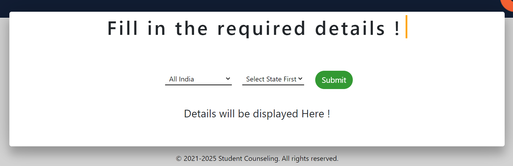
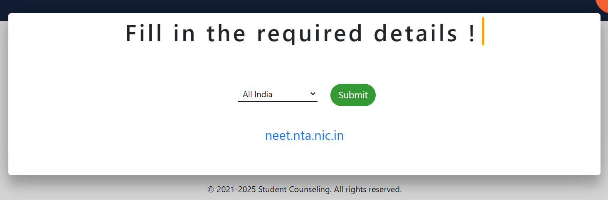
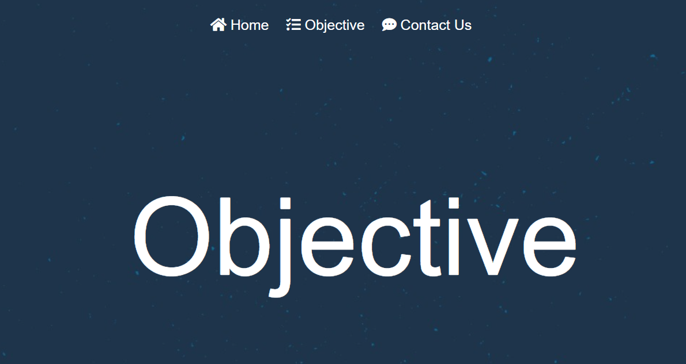
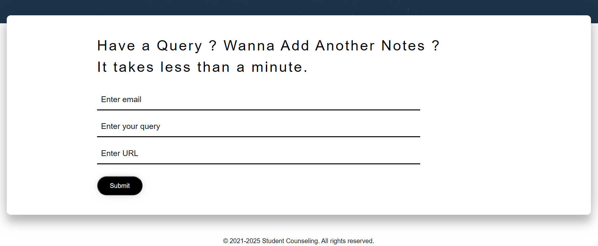

# Team Name : Geeky Trio / Squad

Deployed website Link - [Student Counselling](http://app-575f236b-de41-41eb-9ab6-806b27ddf8d0.cleverapps.io/)

# The Problem
Since every year the entrance exams are held and always there is a constant hustle around millions of students to get their desired seat. And here, counselling plays a major role in admissions to any of the colleges in India.

So, the main problem is to find the major state counsellings and authentic links of the particular counselling website and its schedule. And for which the students and parents have to really work hard and still cannot get something out of it. And it results in, them wasting a lot of time wandering around the YouTube and website links.

# Motivation
So, we have been through the same scenario a year ago and recently our juniors have finished their counsellings and they went through the same hustle. So, we came up with an idea to conquer this problem and provide an authentic way to deal with it and hence saving much time and effort.

# Our Solution
We decided to build a web app, a one-stop destination to solve all this chaos. We have gathered all the important government counselling links for the respective states so that a person or student of any state can check for their own and other state's counselling schedule and procedures, with just a click and does not have to wander around different websites to get their desired search. And the site is made in a very understandable design and layout with very minimalistic and functional features with no extra content bothering around.

## Screenshots
#### Home Page

#### IIT/JEE Page

#### NEET Page

#### OBJECTIVE Page

#### CONTACT-US Page

### Technology Stack used:
- HTML
- CSS
- Bootstrap
- Javascript
- EJS
- Nodejs
- Express

 
# Project Scalability / Future Plans
We are trying to make this site faster and better using other technologies.

In near future, we are planning to make the site responsive and add more state links for the respective state counsellings. We are also planning to expand this idea to more streams such as Commerce and Humanities. 

One another idea on which we planning to work is providing a platform for all the notes and quality college stuff at a single place within this website. And hence, starting and collecting the data from UIET and further expanding it to other colleges within Chandigarh and then so on expanding further.
